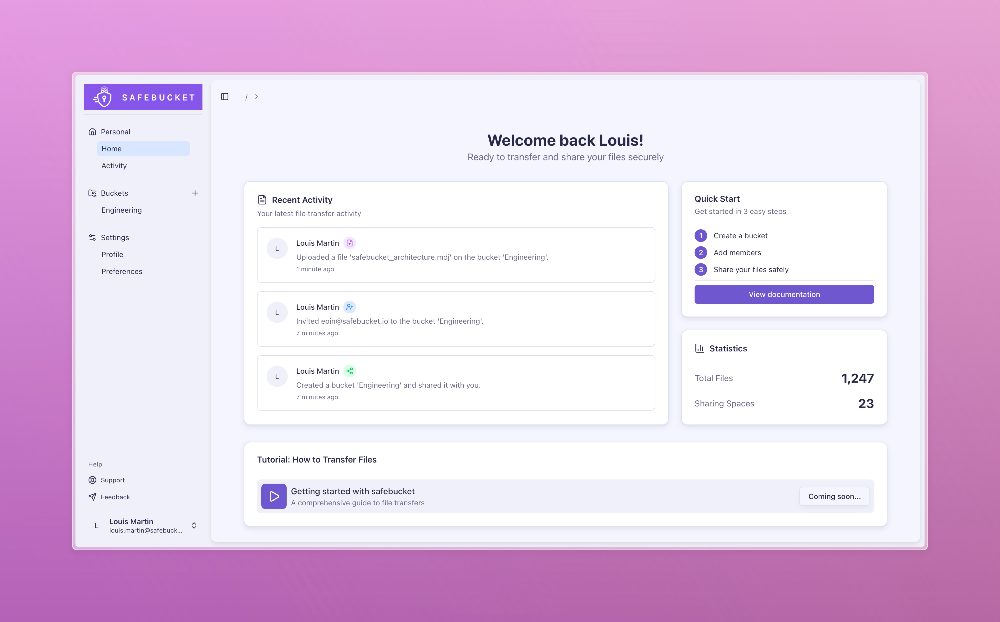

<h1 align="center">
  <a href="https://safebucket.io"></a>
</h1>

## Introduction

Safebucket is an open-source secure file sharing platform designed to share files in an easy and secure way, integrating
with different cloud providers. Built for individuals and organisations that need to collaborate on files with robust
security, flexible access controls, and seamless support across any S3-compatible provider (including AWS
S3, Google Cloud Storage and [more](https://docs.safebucket.io/docs/configuration/storage-providers)).



## Why Safebucket?

Safebucket eliminates the complexity of secure file sharing by providing a lightweight, stateless solution that
integrates seamlessly with your existing infrastructure.
Plug in your preferred storage and auth providers and eliminate the need for local logins - your users can share files using their
existing corporate identities.

## Features

- 🔒 **Secure File Sharing**: Create a bucket to start sharing files and folders with colleagues, customers, and teams
- 👥 **Role-Based Access Control**: Fine grained sharing permissions with owner, contributor, and viewer roles
- 🔐 **SSO Integration**: Single sign-on with any/multiple auth providers and manage their sharing capabilities
- 📧 **User Invitation System**: Invite external collaborators via email
- 📊 **Real-Time Activity Tracking**: Monitor file sharing activity with comprehensive audit trails
- ☁️ **Multi-Storage Integration**: Store and share files across any S3-compatible provider (including AWS S3, Google
  Cloud Storage and [more](https://docs.safebucket.io/docs/configuration/storage-providers))
- 🚀 **Highly Scalable**: Event-driven and cloud native architecture for high-performance operations

## Architecture


## Quick Start

```bash
git clone https://github.com/safebucket/safebucket.git
cd safebucket/deployments/local/full
docker compose up -d
```

- Go to http://localhost:8080
- Log in with:
  - login: admin@safebucket.io
  - password: ChangeMePlease

> **Note:** If you are accessing Safebucket from an external machine (e.g. Proxmox), you need to update the following environment variables in the .env file with your host's IP or domain:
> - `STORAGE__RUSTFS__EXTERNAL_ENDPOINT`
> - `APP__ALLOWED_ORIGINS`
> - `APP__API_URL`
> - `APP__WEB_URL`

## Verify Image Signatures

All published container images are signed with [cosign](https://github.com/sigstore/cosign) using keyless signing via GitHub Actions OIDC: no manual keys are involved.

You can verify the signature of any published image using the following commands:

**Docker Hub:**

```bash
cosign verify \
  --certificate-oidc-issuer=https://token.actions.githubusercontent.com \
  --certificate-identity-regexp=https://github.com/safebucket/safebucket/ \
  docker.io/safebucket/safebucket:<tag>
```

**GHCR:**

```bash
cosign verify \
  --certificate-oidc-issuer=https://token.actions.githubusercontent.com \
  --certificate-identity-regexp=https://github.com/safebucket/safebucket/ \
  ghcr.io/safebucket/safebucket:<tag>
```

Replace `<tag>` with the image tag you want to verify (e.g., `latest`, `v1.0.0`).

## Star History

[](https://www.star-history.com/#safebucket/safebucket&type=date&legend=top-left)

## License

This project is licensed under the Apache 2.0 - see the [LICENSE](LICENSE) file for details.

## Acknowledgments

- Built with ❤️ using Go and React
- UI components by [Radix UI](https://radix-ui.com) and [shadcn/ui](https://ui.shadcn.com)
- Database ORM by [Gorm](https://gorm.io/index.html)
- Database migrations by [Goose](https://github.com/pressly/goose)
- Pub/sub integrations by [Watermill](https://watermill.io)
- Configuration management by [Koanf](https://github.com/knadh/koanf)
- Icons by [Lucide](https://lucide.dev)
