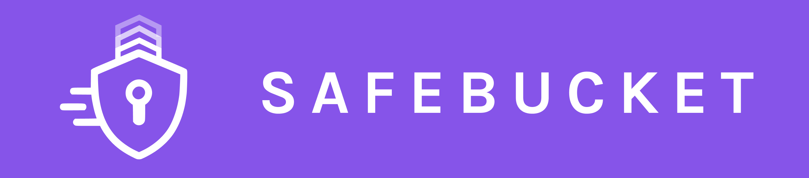
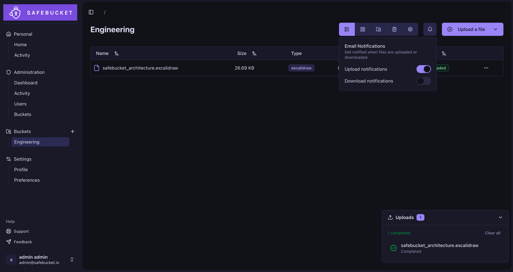

<h1 align="center">
  <a href="https://docs.safebucket.io"></a>
</h1>

Safebucket is an open-source file sharing platform where files never touch your server.
Uploads and downloads go directly to your storage backend. You bring your own identity provider, your
own storage, and your own infrastructure. Safebucket handles metadata, access control and audit logging.



## Why Safebucket?

- **Files bypass the server**: Clients upload and download directly from S3-compatible storage via presigned URLs. The
  API only handles metadata and access control.
- **SSO-first**: Authenticate users with your existing identity providers via OIDC. No need to manage passwords for your
  team.
- **Bucket-scoped access**: All sharing happens through buckets with explicit membership and role-based permissions (
  owner, contributor, viewer).
- **Swappable infrastructure**: Every component (storage, database, events, cache, notifier) can be replaced. Use AWS S3
  or a self-hosted MinIO. Use NATS or SQS. Use PostgreSQL or SQLite, etc...

## Features

- Direct uploads and downloads via presigned URLs
- Role-based access control at platform and bucket level
- SSO via any OIDC provider, with local auth for external users
- Email invitations with challenge-based validation
- Real-time activity tracking and audit logs
- Multifactor authentication (TOTP)
- File expiration, trash with configurable retention
- Admin dashboard with platform-wide statistics

See the [full list of features](https://docs.safebucket.io/features).

## Architecture


## Quick Start

```bash
git clone https://github.com/safebucket/safebucket.git
cd safebucket/deployments/local/lite
docker compose up -d
```

- Go to http://localhost:8080
- Log in with:
    - login: admin@safebucket.io
    - password: ChangeMePlease

> **Note:** If you are accessing Safebucket from an external machine (e.g. Proxmox), you need to update the following
> environment variables in the .env file with your host's IP or domain:
> - `STORAGE__RUSTFS__EXTERNAL_ENDPOINT`
> - `APP__ALLOWED_ORIGINS`
> - `APP__API_URL`
> - `APP__WEB_URL`

## Verify Image Signatures

All published container images are signed with [cosign](https://github.com/sigstore/cosign) using keyless signing via GitHub Actions OIDC: no manual keys are involved.

You can verify the signature of any published image using the following commands:

**Docker Hub:**

```bash
cosign verify \
  --certificate-oidc-issuer=https://token.actions.githubusercontent.com \
  --certificate-identity-regexp=https://github.com/safebucket/safebucket/ \
  docker.io/safebucket/safebucket:<tag>
```

**GHCR:**

```bash
cosign verify \
  --certificate-oidc-issuer=https://token.actions.githubusercontent.com \
  --certificate-identity-regexp=https://github.com/safebucket/safebucket/ \
  ghcr.io/safebucket/safebucket:<tag>
```

Replace `<tag>` with the image tag you want to verify (e.g., `latest`, `v1.0.0`).

## Star History

[](https://www.star-history.com/#safebucket/safebucket&type=date&legend=top-left)

## License

This project is licensed under the Apache 2.0 - see the [LICENSE](LICENSE) file for details.

## Acknowledgments

- Built with ❤️ using Go and React
- UI components by [Radix UI](https://radix-ui.com) and [shadcn/ui](https://ui.shadcn.com)
- Database ORM by [Gorm](https://gorm.io/index.html)
- Database migrations by [Goose](https://github.com/pressly/goose)
- Pub/sub integrations by [Watermill](https://watermill.io)
- Configuration management by [Koanf](https://github.com/knadh/koanf)
- Icons by [Lucide](https://lucide.dev)
